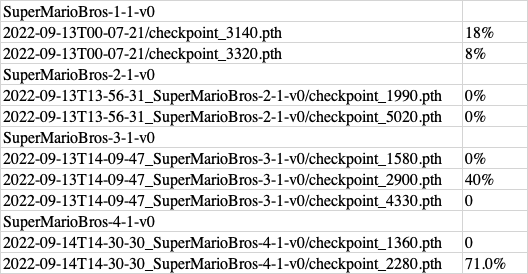

# reinforcement_learning_mario

## environment
https://github.com/Kautenja/gym-super-mario-bros

## results 
###  SuperMarioBros-1-1-v0
2022-09-13T00-07-21/checkpoint_3140.pth 18%
2022-09-13T00-07-21/checkpoint_3320.pth 8%

### SuperMarioBros-2-1-v0
2022-09-13T13-56-31_SuperMarioBros-2-1-v0/checkpoint_1990.pth 0%
2022-09-13T13-56-31_SuperMarioBros-2-1-v0/checkpoint_5020.pth 0%

### SuperMarioBros-3-1-v0
2022-09-13T14-09-47_SuperMarioBros-3-1-v0/checkpoint_1580.pth 0%
2022-09-13T14-09-47_SuperMarioBros-3-1-v0/checkpoint_2900.pth 40%
2022-09-13T14-09-47_SuperMarioBros-3-1-v0/checkpoint_4330.pth 0%

### SuperMarioBros-4-1-v0
2022-09-14T14-30-30_SuperMarioBros-4-1-v0/checkpoint_1360.pth 0%
2022-09-14T14-30-30_SuperMarioBros-4-1-v0/checkpoint_2280.pth 71.0%

